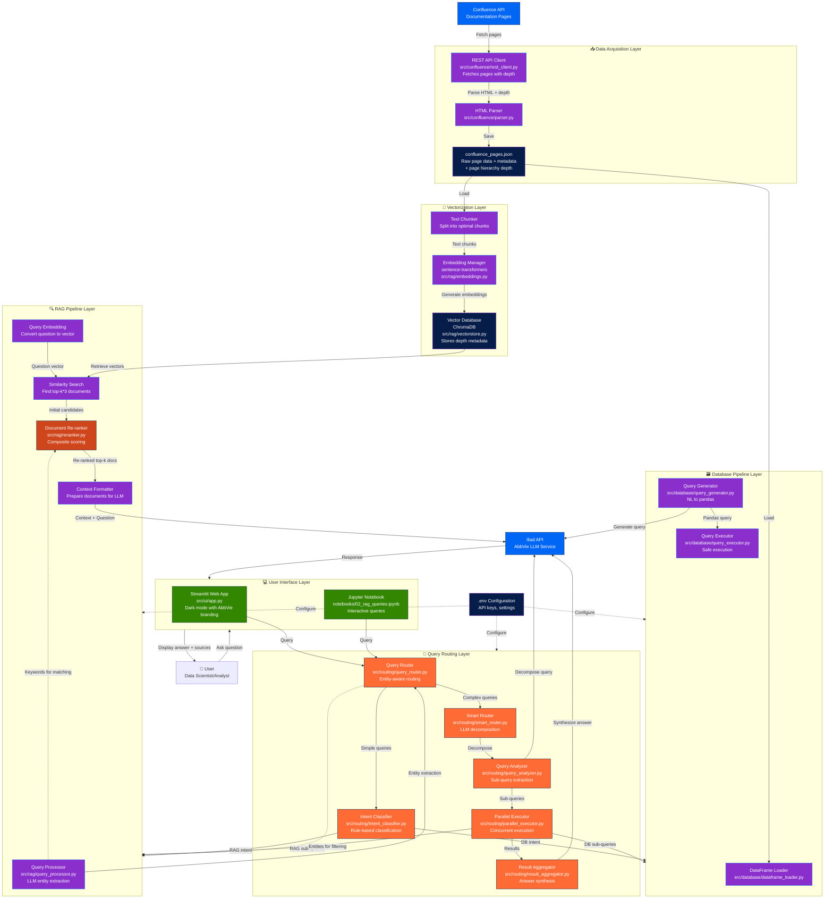

# Confluence RAG System Architecture

## Overview

This document describes the architecture of the Confluence RAG (Retrieval Augmented Generation) system for answering questions about AbbVie Data Science & Analytics projects using Confluence documentation.

## System Architecture Diagram



## Component Details

### 1. Data Acquisition Layer

#### **Confluence REST API Client** (`src/confluence/rest_client.py`)
- Authenticates with Confluence using API token
- Supports both Bearer and Basic authentication
- Fetches all pages from specified space
- Retrieves page metadata (title, URL, author, version, etc.)
- **Calculates page hierarchy depth** (depth 1 = top-level, depth increases with each ancestor)
- Handles pagination and rate limiting

#### **HTML Parser** (`src/confluence/parser.py`)
- Converts Confluence HTML to plain text
- Extracts structure and content
- Removes unnecessary formatting
- Chunks text into optimal sizes (default: 1000 chars with 200 char overlap)

#### **Raw JSON Storage** (`Data_Storage/confluence_pages.json`)
- Stores complete page data with metadata
- Used for reference and source attribution
- Includes: title, URL, author, version, content, external links, hierarchy
- **Now includes page depth** for re-ranking support
- **Includes `main_project` and `main_project_id`** for project-level filtering

### 1.5 Preprocessing Layer

#### **Main Project Extraction**
DSA Confluence follows a hierarchy: Level 1 (DSA) → Level 2 (Categories) → **Level 3 (main_project)** → Level 4+ (subpages)

```python
# Pages at depth 3 ARE the main project
# Pages at depth 4+ inherit main_project from their depth-3 ancestor
main_project = parents[2]["title"]  # 0-indexed
main_project_id = parents[2]["id"]
```

#### **Attachment Processing** (`src/preprocessing/processor.py`)
- Fetches attachments from Confluence pages
- Extracts text content using Iliad OCR/recognition
- **Merges attachment content into `content_text`** with separator
- Uses `--- ATTACHMENT CONTENT ---` delimiter

#### **Attachment Deduplication** (`src/preprocessing/attachment_deduplicator.py`)
- Uses LLM to identify semantically similar attachments
- Compacts duplicate groups into single representation
- Preserves unique information while removing redundancy
- Reduces noise from repeated images/documents

#### **Project Conglomeration** (`src/preprocessing/project_conglomerator.py`)
- Aggregates all pages under each `main_project` into single documents
- Combines `content_text` with page headers: `=== Page Title ===`
- Stores in `Data_Storage/conglomerated_projects.json`
- Used for project-level vector retrieval (Stage 1)

### 2. Vectorization Layer

#### **Text Chunker**
- Splits documents into manageable chunks
- Configurable chunk size (default: 1000 characters)
- Configurable overlap (default: 200 characters)
- Preserves context across chunk boundaries

#### **Embedding Manager** (`src/rag/embeddings.py`)
- Uses sentence-transformers library
- Default model: `all-MiniLM-L6-v2`
- Generates dense vector representations
- Embedding dimension: 384

#### **Vector Database** (`src/rag/vectorstore.py`)
- Numpy arrays + pickle for vector storage
- Stores embeddings with metadata (including main_project)
- Supports similarity search using cosine distance
- **Metadata filtering**: `query_with_filter()` enables project-scoped searches
- Persistent storage in `Data_Storage/vector_db/`

#### **Project Vector Database** (`src/rag/project_vectorstore.py`)
- Separate vector store for project-level retrieval
- Stores conglomerated project documents
- Used in Stage 1 of two-stage RAG for project identification
- Persistent storage in `Data_Storage/project_vector_db/`

### 3. Query Routing Layer

The system features a sophisticated multi-mode query routing architecture that intelligently routes queries to the appropriate pipeline(s) based on intent classification, entity extraction, and query complexity.

#### **Query Router** (`src/routing/query_router.py`)
Central routing orchestrator with two routing modes:

**Rule-Based Mode (Default for simple queries):**
- Fast keyword matching using intent classification
- Entity-aware routing overrides based on extracted entities
- Low latency, no LLM calls required

**Smart Mode (For complex queries):**
- LLM-based query decomposition into atomic sub-queries
- Parallel execution across multiple pipelines
- Result aggregation and synthesis

```
User Query → QueryRouter.route()
                  ↓
    ┌─────────────────────────────────┐
    │  Should use smart routing?      │
    │  (smart mode + complex query)   │
    └─────────────────────────────────┘
           ↓ Yes              ↓ No
    ┌──────────────┐   ┌─────────────────┐
    │ SmartRouter  │   │ Entity-Aware    │
    │ (decompose,  │   │ Rule-Based      │
    │  parallelize,│   │ Classification  │
    │  aggregate)  │   └─────────────────┘
    └──────────────┘
```

#### **Intent Classifier** (`src/routing/intent_classifier.py`)
Classifies query intent using keyword patterns:

| Intent | Indicators | Example |
|--------|-----------|---------|
| **RAG** | "what is", "explain", "describe", "how does" | "What is ALFA?" |
| **DATABASE** | "how many", "count", "list all", "filter" | "How many pages use Python?" |
| **HYBRID** | "summarize", "compare", "and explain" | "List projects and describe them" |
| **CHART** | "chart", "graph", "visualize", "plot" | "Show me a chart of pages by author" |

#### **LLM Query Analyzer** (`src/routing/query_analyzer.py`)
Decomposes complex queries into atomic sub-queries using LLM:

**Sub-Query Intent Types:**
- `RAG`: Semantic search (explain, describe, what is)
- `DATABASE`: Structured query (count, list, filter)
- `HYBRID`: Requires both pipelines

**Example Decomposition:**
```
Query: "What is ALFA and how many pages mention it?"
         ↓
Sub-queries:
  1. [RAG] "Describe the ALFA project, its purpose, and key details"
  2. [DATABASE] "Count how many pages mention or reference ALFA"
```

**Sub-Query Features:**
- `depends_on`: Index of sub-query this depends on (for sequential execution)
- `priority`: Execution priority (lower = higher priority)
- `store_as`: Key to store result in context for later queries

#### **Parallel Query Executor** (`src/routing/parallel_executor.py`)
Executes sub-queries in parallel with dependency management:

```
Execution Plan:
  Group 1 (parallel): [Sub-query 1, Sub-query 2] → No dependencies
  Group 2 (sequential): [Sub-query 3] → Depends on Group 1
                  ↓
  ThreadPoolExecutor (max_workers=4, timeout=30s)
                  ↓
  Results collected as SubQueryResult objects
```

#### **Result Aggregator** (`src/routing/result_aggregator.py`)
Combines results from multiple sub-queries:
- Merges sources from RAG queries
- Collects generated SQL/pandas queries
- Uses LLM to synthesize coherent final answer

#### **Response Combiner** (`src/routing/response_combiner.py`)
Combines RAG and Database pipeline results for hybrid queries:
- Formats database results for display
- Merges source citations
- Handles partial failures gracefully

### 4. RAG Pipeline Layer

#### **Query Processor** (`src/rag/query_processor.py`)
Preprocesses user queries using LLM-based extraction with regex fallback:

**LLM Extraction (Primary):**
- Uses Iliad API with few-shot prompting
- Extracts structured information from natural language
- High confidence (0.9) extraction

**Regex Extraction (Fallback):**
- Pattern matching for common entities
- Lower confidence (0.5) but no API dependency

**Extracted Information:**
- `cleaned_query`: Query with question words removed
- `keywords`: Important search terms
- `potential_project_names`: Detected project names/acronyms
- `potential_person_names`: Detected person names
- `dates`: Date references (years, quarters, months)
- `technologies`: Programming languages, tools, frameworks
- `is_comparative`: Whether query compares entities
- `query_intent`: One of informational/comparison/aggregation/listing/how-to

#### **Document Re-ranker** (`src/rag/reranker.py`)
Re-ranks retrieved documents using composite scoring:

**Scoring Signals (configurable weights):**
| Signal | Default Weight | Description |
|--------|---------------|-------------|
| Content Similarity | 0.35 | Vector similarity to page content |
| Title Similarity | 0.25 | Vector similarity to page title |
| Keyword in Title | 0.20 | Keywords found in page title |
| Page Depth | 0.10 | Shallower pages score higher |
| Has Children | 0.05 | Pages with children may be more important |
| Keyword in Content | 0.05 | Keywords found in page content |

**Configuration:**
```python
from rag.reranker import RankingWeights

custom_weights = RankingWeights(
    content_similarity=0.40,
    title_similarity=0.20,
    keyword_in_title=0.25,
    page_depth=0.10,
    has_children=0.03,
    keyword_in_content=0.02,
)
```

#### **Query Processing** (`src/rag/pipeline.py`)
The RAG pipeline orchestrates the following steps:

1. **Query Preprocessing** (NEW)
   - Extracts keywords using QueryProcessor
   - Identifies project names and person names
   - Logs analysis for debugging

2. **Query Embedding**
   - Converts user question to vector using same embedding model
   - Ensures semantic similarity matching

3. **Initial Retrieval**
   - Queries vector database with question embedding
   - Retrieves top-k*3 documents (3x requested) for re-ranking pool
   - Returns documents with similarity scores (distances)

4. **Re-ranking** (NEW)
   - Applies composite scoring using DocumentReranker
   - Combines multiple signals: content similarity, title matching, keywords, page depth
   - Returns top-k best-ranked documents

5. **Context Formatting**
   - Formats retrieved documents into structured context
   - Includes metadata (title, URL, type)
   - Prepares prompt for LLM

6. **Iliad API Call**
   - Sends instructions and context to AbbVie's Iliad LLM service
   - Request format:
     ```json
     {
       "messages": [
         {"role": "user", "content": "instructions"},
         {"role": "user", "content": "context"}
       ]
     }
     ```
   - Authentication via X-API-Key header

7. **Response Parsing**
   - Extracts answer from response structure:
     ```json
     {
       "response_id": "...",
       "completion": {
         "role": "assistant",
         "content": "answer text"
       }
     }
     ```
   - Returns clean answer text via `response['completion']['content']`

## Query Routing Architecture

The system implements a sophisticated routing architecture that intelligently directs queries to the appropriate pipeline(s).

### Routing Flow Diagram

```
┌─────────────────────────────────────────────────────────────────────────────────────┐
│                              QUERY ROUTING FLOW                                      │
├─────────────────────────────────────────────────────────────────────────────────────┤
│                                                                                      │
│  User Query: "What is ALFA and how many pages mention it?"                          │
│                                       ↓                                              │
│  ┌─────────────────────────────────────────────────────────────────────────────┐    │
│  │                    ENTITY EXTRACTION (QueryProcessor)                        │    │
│  │  Uses LLM to extract: projects=["ALFA"], people=[], intent="informational"  │    │
│  └─────────────────────────────────────────────────────────────────────────────┘    │
│                                       ↓                                              │
│  ┌─────────────────────────────────────────────────────────────────────────────┐    │
│  │                    ROUTING MODE SELECTION                                    │    │
│  │                                                                               │    │
│  │  use_smart_routing=True  AND  complex query?                                 │    │
│  │           ↓ Yes                        ↓ No                                  │    │
│  │  ┌─────────────────┐        ┌───────────────────────┐                       │    │
│  │  │  SMART ROUTER   │        │  RULE-BASED ROUTER    │                       │    │
│  │  │  (LLM-based)    │        │  (Keyword matching)   │                       │    │
│  │  └─────────────────┘        └───────────────────────┘                       │    │
│  └─────────────────────────────────────────────────────────────────────────────┘    │
│                                       ↓                                              │
│  ┌─────────────────────────────────────────────────────────────────────────────┐    │
│  │                    SMART ROUTING PATH                                        │    │
│  │                                                                               │    │
│  │  1. LLM Query Analyzer decomposes into sub-queries:                         │    │
│  │     • [RAG, priority=0] "Describe the ALFA project"                         │    │
│  │     • [DATABASE, priority=1] "Count pages mentioning ALFA"                  │    │
│  │                                                                               │    │
│  │  2. Parallel Executor creates execution plan:                                │    │
│  │     Group 1 (parallel): Sub-queries with no dependencies                     │    │
│  │     Group 2 (sequential): Sub-queries depending on Group 1                   │    │
│  │                                                                               │    │
│  │  3. Execute via ThreadPoolExecutor (max_workers=4)                          │    │
│  │                                                                               │    │
│  │  4. Result Aggregator synthesizes final answer via LLM                      │    │
│  └─────────────────────────────────────────────────────────────────────────────┘    │
│                                       ↓                                              │
│  ┌─────────────────────────────────────────────────────────────────────────────┐    │
│  │                    RULE-BASED ROUTING PATH                                   │    │
│  │                                                                               │    │
│  │  1. Intent Classifier scores query against keyword patterns                  │    │
│  │     • db_score: "how many" → 0.33                                           │    │
│  │     • rag_score: "what is" → 0.33                                           │    │
│  │     • Result: HYBRID (both scores > 0.3)                                    │    │
│  │                                                                               │    │
│  │  2. Entity-Based Override (if entities extracted):                          │    │
│  │     • No entities + aggregation intent → Force DATABASE                      │    │
│  │     • Entities found + database intent → Consider HYBRID                     │    │
│  │                                                                               │    │
│  │  3. Route to appropriate pipeline(s):                                        │    │
│  │     • RAG → Semantic search pipeline                                        │    │
│  │     • DATABASE → Structured query pipeline                                   │    │
│  │     • HYBRID → Both pipelines + ResponseCombiner                            │    │
│  │     • CHART → Database + ChartGenerator                                      │    │
│  └─────────────────────────────────────────────────────────────────────────────┘    │
│                                                                                      │
└─────────────────────────────────────────────────────────────────────────────────────┘
```

### Routing Configuration

| Parameter | Default | Description |
|-----------|---------|-------------|
| `use_smart_routing` | `true` | Enable LLM-based query decomposition |
| `use_entity_routing` | `true` | Use entity extraction to inform routing |
| `use_llm_fallback` | `false` | Use LLM for ambiguous intent classification |
| `analyzer_model` | `gpt-4o-mini-global` | Model for query analysis |
| `synthesis_model` | `gpt-4o-mini-global` | Model for result synthesis |
| `max_workers` | `4` | Maximum parallel workers for sub-query execution |
| `query_timeout` | `30.0` | Timeout per sub-query in seconds |

### Multi-Step Query Routing

For complex queries requiring context from earlier steps (e.g., "What projects are similar to ALFA?"), the system uses the `AgentOrchestrator` via `route_multistep()`:

```python
# Standard smart routing (decomposition + parallel execution)
result = router.route("What is ALFA and how many pages mention it?")

# Multi-step routing (agent orchestration with feedback)
result = router.route_multistep("What projects are similar to ALFA?")
```

## Two-Stage RAG Architecture

The system supports two-stage project-filtered retrieval for improved accuracy:

### Stage 1: Project Identification

```
User Query → Project Vector Store → Identify Top-K Projects
```

- Uses `ProjectVectorStore` with conglomerated project documents
- Returns most relevant main projects based on query semantics
- Default: identifies top 3 projects

### Stage 2: Filtered Chunk Retrieval

```
Query + Identified Projects → Chunk Vector Store (filtered) → Relevant Chunks
```

- Uses `VectorStore.query_with_filter()` with `main_project` filter
- Only retrieves chunks belonging to identified projects
- Significantly improves precision for project-specific queries

### Two-Stage Flow Diagram

```
┌─────────────────────────────────────────────────────────────────────────┐
│                     TWO-STAGE RAG RETRIEVAL                             │
├─────────────────────────────────────────────────────────────────────────┤
│                                                                         │
│  User Query: "How does ATLAS handle data processing?"                   │
│                              ↓                                          │
│  ┌─────────────────────────────────────────────────────────────┐       │
│  │          STAGE 1: PROJECT IDENTIFICATION                     │       │
│  │                                                               │       │
│  │  Project Vector DB   →   Query Projects   →   ["ATLAS"]      │       │
│  │  (conglomerated)                                              │       │
│  └─────────────────────────────────────────────────────────────┘       │
│                              ↓                                          │
│  ┌─────────────────────────────────────────────────────────────┐       │
│  │          STAGE 2: FILTERED CHUNK RETRIEVAL                   │       │
│  │                                                               │       │
│  │  Chunk Vector DB   →   Query with Filter   →   ATLAS Chunks  │       │
│  │  (filter: main_project IN ["ATLAS"])                         │       │
│  └─────────────────────────────────────────────────────────────┘       │
│                              ↓                                          │
│           Re-rank → Format Context → Iliad API → Answer                 │
│                                                                         │
└─────────────────────────────────────────────────────────────────────────┘
```

### Comparative Query Handling

For queries comparing multiple projects (e.g., "Compare ALFA to GraphRAG"):

```
Query → Detect Comparative Pattern → Identify Both Projects
     → Retrieve Chunks from Each Project → Synthesize Comparison
```

The `QueryProcessor.is_comparative_query()` detects patterns like:
- "compare X to Y"
- "X vs Y"
- "difference between X and Y"

### Configuration

| Variable | Default | Description |
|----------|---------|-------------|
| `ENABLE_TWO_STAGE_RAG` | `true` | Enable two-stage retrieval |
| `PROJECT_RETRIEVAL_TOP_K` | `3` | Projects to identify in Stage 1 |
| `PROJECT_VECTOR_DB_PATH` | `./Data_Storage/project_vector_db` | Project DB location |

### When Two-Stage is Used

Two-stage retrieval is automatically enabled when:
1. `ENABLE_TWO_STAGE_RAG` is `true`
2. Project vector store is initialized
3. Conglomerated projects exist

Falls back to standard retrieval if project identification returns no results.

### 4. User Interface Layer

#### **Streamlit Web Application** (`src/ui/app.py`)

**Features:**
- Dark mode interface with AbbVie branding
- Real-time question answering
- Adjustable top-k parameter (1-20 documents)
- **Smart Source Display**: Deduplicated by URL with document reference tracking
- **Relevance Score Grouping**: Scores grouped by unique page with best score shown
- **Automatic Table Display**: JSON/list answers rendered as scrollable DataFrames
- **Chart Visualization**: Auto-detection of chartable data with Plotly integration
- **Cache Control**: "Reload Pipelines" button to clear `@st.cache_resource`
- Expandable debug information with source structure analysis

**Color Scheme:**
- Background: Dark (`#0E1117`)
- Primary: AbbVie Purple (`#8A2ECC`)
- Secondary: AbbVie Cobalt (`#0066F5`)
- Sidebar: AbbVie Dark Blue (`#071D49`)
- Text: White with medium blue highlights

**Workflow:**
1. User enters question in text input
2. Pipeline retrieves relevant documents (multiple chunks may come from same page)
3. Context sent to Iliad API
4. Answer displayed with smart formatting:
   - Plain text: Markdown rendering
   - JSON/List: Scrollable DataFrame table
   - Numeric data: Auto-generated Plotly chart
5. Sources shown with deduplication:
   - Grouped by URL to show unique pages
   - Document references indicate which chunks came from each page
   - Example: "📄 1. Page Title (Documents 1, 2, 4)"
6. Relevance scores in sidebar grouped by unique source

#### **Django Web Application** (`web_app/`)

**Features:**
- Google-like landing page with centered search
- Real-time progress bar with WebSocket updates
- Debug panel showing routing info, entities, and execution details
- Smart answer display (Markdown, tables, charts)
- Source document viewer with deduplication
- REST API for programmatic access
- Dark mode with AbbVie branding

**Components:**

| Module | Purpose |
|--------|---------|
| `core/` | Main app (landing, search, results views) |
| `api/` | REST API endpoints (query, status, health) |
| `realtime/` | WebSocket consumers for progress |
| `templates/` | Jinja2 templates with components |
| `static/` | CSS (AbbVie theme), JS (progress, charts) |

**REST API Endpoints:**

| Endpoint | Method | Description |
|----------|--------|-------------|
| `/api/v1/query/` | POST | Execute query (sync/async) |
| `/api/v1/query/{id}/status/` | GET | Check query status |
| `/api/v1/health/` | GET | Service health check |

**Running:**
```bash
cd web_app
python manage.py migrate
python manage.py runserver
# Visit http://localhost:8000
```

#### **Jupyter Notebook** (`notebooks/02_rag_queries.ipynb`)

**Features:**
- Interactive question answering
- Batch query processing
- Context chunk visualization
- Results export to JSON
- Widget-based UI for experimentation

**Use Cases:**
- Ad-hoc queries
- Pipeline testing
- Batch processing
- Result analysis

## Document Chunking and Source Handling

### Why Documents Are Chunked

Confluence pages are split into smaller chunks (default: 1000 characters with 200 character overlap) for several reasons:
- **Embedding Quality**: Smaller chunks produce more focused embeddings
- **Context Limits**: LLMs have token limits; chunking ensures relevant content fits
- **Granular Retrieval**: Multiple relevant sections from one page can be retrieved

### Source Deduplication Strategy

Since multiple chunks from the same page can be retrieved:

```
Page "Project Documentation" → Chunk 1, Chunk 2, Chunk 3 (stored separately)
                                  ↓
Query: "What is the project about?"
                                  ↓
Retrieved: Chunk 1 (Doc 1), Chunk 3 (Doc 2), Other Page Chunk (Doc 3)
                                  ↓
LLM sees: Document 1, Document 2, Document 3
                                  ↓
UI Display: "📄 1. Project Documentation (Documents 1, 2)"
            "📄 2. Other Page (Document 3)"
```

**Key Design Decisions:**
1. **No deduplication during retrieval**: All relevant chunks are sent to LLM for complete context
2. **Deduplication in UI only**: Sources grouped by URL for cleaner display
3. **Document reference tracking**: Shows which LLM document numbers map to each source
4. **Best score display**: For pages with multiple chunks, shows highest relevance score

### Chunk Statistics Example

A typical vector store might contain:
- 9,514 total chunks from 1,539 unique pages
- Some pages have 100+ chunks (e.g., meeting minutes with extensive content)
- Average: ~6 chunks per page

## Data Flow

### Phase 1: Data Acquisition (One-time Setup)

```
Confluence → REST Client → Parser → JSON Storage → Chunker → Embeddings → Vector DB
```

**Execution:**
- Run `python src/confluence/fetch_pages.py` to fetch pages
- Run `python src/rag/vectorize_data.py` to create embeddings
- Or use `notebooks/01_data_acquisition.ipynb` for interactive setup

### Phase 2: Query Processing (Runtime)

#### Simple Query Flow (Rule-Based Routing)
```
User Question → QueryRouter → IntentClassifier → [RAG/DB/HYBRID Pipeline] →
Response → Answer Display
```

#### Complex Query Flow (Smart Routing)
```
User Question → QueryRouter → SmartRouter → LLMQueryAnalyzer (decompose) →
ParallelQueryExecutor → [RAG + DB Pipelines] → ResultAggregator → Answer Display
```

#### RAG Pipeline Flow
```
Query → QueryProcessor (entity extraction) → Query Embedding →
Vector Search (top-k*3) → Re-ranker → Top-k Docs → Context Format →
Iliad API → Response Parse → Answer
```

#### Database Pipeline Flow
```
Query → QueryGenerator (NL to pandas) → QueryExecutor (safe execution) →
Format Result → Answer
```

**Latency Breakdown:**
- Query preprocessing (LLM): ~100-500ms
- Entity extraction: ~200-800ms
- Query decomposition (smart mode): ~500-1500ms
- Embedding generation: ~10-50ms
- Vector search: ~50-200ms
- Re-ranking: ~20-100ms
- Parallel sub-query execution: ~1-5 seconds (overlapped)
- Result synthesis (smart mode): ~500-1500ms
- Total (rule-based): ~1-6 seconds per query
- Total (smart mode): ~3-10 seconds per query

## Configuration

### Environment Variables (`.env`)

```bash
# Iliad API
ILIAD_API_KEY=your_api_key
ILIAD_API_URL=https://your-iliad-url.com/endpoint

# Confluence
CONFLUENCE_URL=https://your-confluence.atlassian.net
CONFLUENCE_USERNAME=your_email@abbvie.com
CONFLUENCE_API_TOKEN=your_api_token
CONFLUENCE_SPACE_KEY=DSA

# Vector Database
VECTOR_DB_PATH=./Data_Storage/vector_db
EMBEDDING_MODEL=all-MiniLM-L6-v2

# RAG Settings
CHUNK_SIZE=1000
CHUNK_OVERLAP=200
TOP_K_RESULTS=10
```

### Configuration Management (`src/config.py`)

- Loads environment variables using `python-dotenv`
- Validates required configurations
- Provides default values
- Type-safe configuration access via `ConfigConfluenceRag` class

## Technology Stack

### Core Libraries

| Component | Technology | Purpose |
|-----------|-----------|---------|
| Vector DB | ChromaDB | Efficient similarity search |
| Embeddings | sentence-transformers | Text → vector conversion |
| NLP | NLTK | Stop words, tokenization, lemmatization |
| LLM API | AbbVie Iliad | Answer generation, query analysis, result synthesis |
| Parallel Execution | concurrent.futures | ThreadPoolExecutor for sub-query parallelization |
| Web UI | Streamlit | Interactive interface |
| Notebooks | Jupyter | Experimentation & batch processing |
| HTTP Client | requests | API calls |
| Logging | loguru | Structured logging |
| Config | python-dotenv | Environment management |

### Routing Components

| Component | Module | Purpose |
|-----------|--------|---------|
| QueryRouter | `src/routing/query_router.py` | Central routing orchestrator |
| IntentClassifier | `src/routing/intent_classifier.py` | Rule-based intent classification |
| SmartQueryRouter | `src/routing/smart_router.py` | LLM-based routing with orchestrator |
| LLMQueryAnalyzer | `src/routing/query_analyzer.py` | Query decomposition into sub-queries |
| ParallelQueryExecutor | `src/routing/parallel_executor.py` | Concurrent sub-query execution |
| ResultAggregator | `src/routing/result_aggregator.py` | Multi-result synthesis |
| ResponseCombiner | `src/routing/response_combiner.py` | Hybrid result combination |

### Data Formats

- **Input:** Confluence HTML pages
- **Storage:** JSON (raw data), ChromaDB (vectors)
- **Embeddings:** 384-dimensional float vectors
- **Output:** Markdown-formatted text

## Security Considerations

### API Keys
- Stored in `.env` file (gitignored)
- Loaded at runtime
- Never committed to version control

### Data Storage
- All data directories gitignored
- `Data_Storage/` contains sensitive information
- Vector DB excluded from repository

### SSL/TLS
- Confluence API supports SSL verification
- Can disable for internal instances (`verify_ssl=False`)
- Iliad API uses HTTPS

## Performance Optimization

### Caching
- Streamlit caches RAG pipeline initialization (`@st.cache_resource`)
- Vector database persists to disk
- Embeddings generated once during data acquisition
- **Cache Control**: "🔄 Reload Pipelines" button clears all cached resources
- Python bytecode cache (`.pyc`) should be cleared after code changes

### Scalability
- Batch embedding generation for large datasets
- Configurable chunk size for memory management
- Adjustable top-k for speed vs accuracy tradeoff

### Best Practices
- Use smaller embedding models for faster inference
- Reduce top-k for quicker responses
- Implement batch processing for multiple queries
- Monitor Iliad API rate limits

## Monitoring and Debugging

### Logging
- Structured logging with loguru
- Log levels: INFO, DEBUG, WARNING, ERROR
- Includes timing information
- Response structure validation

### Debug Features
- Streamlit debug expander shows:
  - Question text
  - Number of sources
  - Distance scores
  - Source structure analysis (has_document_index, keys)
  - Pipeline routing information
- Notebook shows:
  - Retrieved context chunks
  - Relevance scores
  - Full response structure

## Answer Display System

### Smart Answer Formatting (`display_answer` function)

The UI intelligently formats answers based on content type:

| Answer Type | Detection | Display Method |
|-------------|-----------|----------------|
| Plain text | String without structure | `st.markdown()` |
| JSON object | Dict with string keys | `st.dataframe()` scrollable table |
| List of records | List of dicts | `st.dataframe()` with height limit |
| Numeric data | Dict/list with numeric values | `st.plotly_chart()` auto-generated |

### Table Display Features
- Automatic detection of JSON/list answers from database queries
- Scrollable tables for results with >10 rows (`height=400`)
- Clean column headers from dict keys
- Handles nested structures gracefully

### Chart Generation
- Uses `is_chartable_data()` to detect visualizable data
- Supports bar charts, pie charts, and more via `ChartGenerator`
- Native Streamlit integration with `st.plotly_chart()`
- Auto-generated for database aggregation results

## Routing Package Structure

The query routing system is organized as a cohesive package under `src/routing/`:

```
src/routing/
├── __init__.py              # Package exports
├── query_router.py          # QueryRouter - main entry point for routing
├── intent_classifier.py     # IntentClassifier - rule-based intent detection
├── smart_router.py          # SmartQueryRouter - LLM-based decomposition
├── query_analyzer.py        # LLMQueryAnalyzer - sub-query extraction
├── parallel_executor.py     # ParallelQueryExecutor - concurrent execution
├── result_aggregator.py     # ResultAggregator - answer synthesis
└── response_combiner.py     # ResponseCombiner - hybrid result combination
```

### Key Data Classes

```python
# Sub-query representation (query_analyzer.py)
@dataclass
class SubQuery:
    text: str                          # The sub-query text
    intent: SubQueryIntent             # RAG/DATABASE/HYBRID
    depends_on: Optional[int] = None   # Dependency index
    priority: int = 0                  # Execution priority
    store_as: Optional[str] = None     # Context storage key

# Sub-query result (parallel_executor.py)
@dataclass
class SubQueryResult:
    sub_query: SubQuery
    success: bool
    answer: Any = None
    sources: List[Dict] = field(default_factory=list)
    query: Optional[str] = None        # Generated DB query
    execution_time: float = 0.0

# Smart routing result (smart_router.py)
@dataclass
class SmartRouteResult:
    success: bool
    answer: str
    original_query: str
    sub_results: List[SubQueryResult]
    sources: List[Dict]
    queries: List[str]                 # All generated queries
    execution_time: float
    metadata: Dict
```

## Agent Framework Architecture

### Overview

The system includes an agent framework for handling complex, multi-step queries that require information from one step to inform subsequent steps. This enables queries like "What projects are similar to ALFA?" which require:
1. First getting information about ALFA
2. Using that information to find similar projects

### Agent Framework Components

```
src/agents/
├── __init__.py           # Package exports
├── base.py               # BaseAgent, AgentContext, AgentResult, AgentStatus
├── rag_agent.py          # RAGAgent - wraps RAGPipeline
├── database_agent.py     # DatabaseAgent - wraps DatabasePipeline
├── plotting_agent.py     # PlottingAgent - wraps ChartGenerator
├── iterative_agent.py    # IterativeDescribeAgent - list+describe pattern
├── feedback_controller.py # Manages feedback loops and refinement
└── orchestrator.py       # AgentOrchestrator - coordinates agents
```

### Core Classes

#### BaseAgent (`src/agents/base.py`)
Abstract base class that all agents inherit from:
- `execute(query, context)` - Execute the agent's primary function
- `can_handle(query, context)` - Return confidence score (0-1)
- `validate_result(result, context)` - Validate if result is satisfactory

#### AgentContext
Shared context passed between agents:
- `original_query` - User's original query
- `intermediate_results` - Dict storing results from previous steps
- `iteration` / `max_iterations` - Feedback loop tracking
- `execution_history` - List of (agent_name, query) tuples

#### AgentResult
Standardized result from agent execution:
- `status` - PENDING, RUNNING, SUCCESS, NEEDS_REFINEMENT, FAILED
- `data` - Result data (varies by agent type)
- `needs_followup` - Whether a follow-up query is needed
- `followup_query` - The follow-up query if needed
- `confidence` - Confidence score (0-1)

### Available Agents

| Agent | Purpose | Wraps |
|-------|---------|-------|
| RAGAgent | Semantic search, explanations, documentation | RAGPipeline |
| DatabaseAgent | Counts, lists, aggregations, filtering | DatabasePipeline |
| PlottingAgent | Chart and visualization generation | ChartGenerator |
| IterativeDescribeAgent | List items then describe each | RAGAgent + DatabaseAgent |

### AgentOrchestrator (`src/agents/orchestrator.py`)

Coordinates multi-agent execution with:
1. **LLM-based Planning** - Decomposes complex queries into execution steps
2. **Dependency Management** - Handles step dependencies
3. **Parallel Execution** - Runs independent steps concurrently
4. **Feedback Loops** - Refines results when needed
5. **Result Synthesis** - Combines results into coherent answer

### Multi-Step Query Flow

```
User Query: "What projects are similar to ALFA?"
                    ↓
    [Orchestrator: Create Execution Plan]
                    ↓
    Step 1: RAGAgent("Summarize ALFA project")
            → Store result as "project_summary"
                    ↓
    Step 2: RAGAgent("Find projects similar to: {project_summary}")
            → Uses injected context from Step 1
                    ↓
    [Orchestrator: Synthesize Results]
                    ↓
    Final Answer: Combined response
```

### List+Describe Query Pattern

For queries like "List all projects using XGBoost and describe all these projects", the system uses the `IterativeDescribeAgent` which ensures comprehensive results by:

1. **Getting Complete List from Database** - Uses DatabaseAgent to get ALL matching items
2. **Describing Each Item via RAG** - Iterates through each item, running RAG queries
3. **Synthesizing Results** - Combines all descriptions into a comprehensive answer

```
User Query: "List all projects that use XGBoost and describe all these projects"
                    ↓
    [Orchestrator: Detect list+describe pattern]
                    ↓
    [IterativeDescribeAgent]
                    ↓
    Step 1: DatabaseAgent("List all projects that use XGBoost")
            → Returns: ["Project A", "Project B", "Project C", ...]
                    ↓
    Step 2: For each item:
            RAGAgent("Describe Project A in detail")
            RAGAgent("Describe Project B in detail")
            RAGAgent("Describe Project C in detail")
            ...
                    ↓
    Step 3: Synthesize all descriptions
                    ↓
    Final Answer: Comprehensive descriptions of ALL projects
```

**Why This Pattern is Needed:**
- RAG retrieval typically returns 5-10 documents, potentially missing items
- Database queries return ALL matching items from the structured data
- By getting the complete list first, then describing each, we ensure comprehensive coverage

**Pattern Detection:**
The orchestrator detects these queries via keyword patterns:
- List keywords: "list all", "what projects", "which projects", "show all", etc.
- Describe keywords: "describe all", "describe each", "and describe", "explain them", etc.

### FeedbackController (`src/agents/feedback_controller.py`)

Manages feedback loops for query refinement:

**Default Triggers:**
| Trigger | Condition | Action |
|---------|-----------|--------|
| Empty Result | Answer < 30 chars | Request more details |
| Low Confidence | Distance > 0.6 | Search alternative terms |
| Not Found | Response contains "not found" | Broaden search |
| Empty DB Result | List result is empty | Relax filters |

**Context Injection:**
Supports `{placeholder}` syntax in queries:
```python
query_template = "Find projects similar to: {project_summary}"
# Filled with: "Find projects similar to: ALFA is an ML project for..."
```

### Integration with SmartQueryRouter

The `SmartQueryRouter` includes orchestrator integration:

```python
router = SmartQueryRouter(rag_pipeline, db_pipeline, iliad_client)

# Standard routing (decomposition + parallel execution)
result = router.route("What is ALFA?")

# Multi-step routing (agent orchestration with feedback)
result = router.route_multistep("What projects are similar to ALFA?")
```

### Extending the Framework

#### Adding New Agents

```python
from agents.base import BaseAgent, AgentContext, AgentResult, AgentStatus

class JiraAgent(BaseAgent):
    def __init__(self, jira_client):
        super().__init__(
            name="jira_agent",
            description="Query Jira tickets and sprints",
        )
        self.jira_client = jira_client

    def execute(self, query, context):
        # Implementation
        return AgentResult(status=AgentStatus.SUCCESS, data=result)

    def can_handle(self, query, context):
        return 0.8 if "ticket" in query.lower() else 0.1

# Register with orchestrator
orchestrator.register_agent(JiraAgent(jira_client))
```

#### Custom Refinement Triggers

```python
from agents.feedback_controller import RefinementTrigger

controller.register_trigger(RefinementTrigger(
    name="custom_trigger",
    condition=lambda result, query: "error" in str(result).lower(),
    generate_followup=lambda result, query: f"Retry with different approach: {query}",
    max_triggers=2,
))
```

## Future Enhancements

### Potential Improvements
1. ~~**Re-ranking:** Use composite scoring for improved relevance~~ ✅ IMPLEMENTED
2. ~~**Source Deduplication:** Group sources by URL with document reference tracking~~ ✅ IMPLEMENTED
3. ~~**Smart Display:** Auto-detect and format tables/charts~~ ✅ IMPLEMENTED
4. ~~**Chart Visualization:** Native Plotly integration~~ ✅ IMPLEMENTED
5. ~~**Multi-step Queries:** Agent framework with feedback loops~~ ✅ IMPLEMENTED
6. ~~**Agent Framework:** Modular, extensible agent architecture~~ ✅ IMPLEMENTED
7. ~~**Two-Stage RAG:** Project-filtered retrieval for improved accuracy~~ ✅ IMPLEMENTED
8. ~~**Project Conglomeration:** Aggregate pages by main project~~ ✅ IMPLEMENTED
9. ~~**Attachment Processing:** Merge attachment content with page content~~ ✅ IMPLEMENTED
10. ~~**Duplicate Detection:** LLM-based attachment deduplication~~ ✅ IMPLEMENTED
11. ~~**Comparative Queries:** Detect and handle comparison queries~~ ✅ IMPLEMENTED
12. ~~**Smart Query Routing:** LLM-based query decomposition and parallel execution~~ ✅ IMPLEMENTED
13. ~~**Entity-Aware Routing:** Use extracted entities to inform routing decisions~~ ✅ IMPLEMENTED
14. ~~**Query Decomposition:** Split complex queries into atomic sub-queries~~ ✅ IMPLEMENTED
15. ~~**Parallel Sub-Query Execution:** Execute independent sub-queries concurrently~~ ✅ IMPLEMENTED
16. **Hybrid Search:** Combine vector search with BM25 keyword search
17. **Cross-encoder Re-ranking:** Use cross-encoder models for more accurate relevance
18. **Conversation History:** Support multi-turn conversations
19. **Analytics:** Track query patterns and performance metrics
20. **Feedback Loop:** Collect user feedback to improve results
21. **Auto-refresh:** Periodically update vector DB with new content
22. **Named Entity Recognition:** Use spaCy for better project/person name extraction
23. **Additional Data Sources:** Jira, SharePoint integration via agent framework
24. **API Deployment:** Expose orchestrator as REST API endpoint

## Deployment

### Local Development
```bash
# Setup
python -m venv .venv
source .venv/bin/activate
pip install -r requirements.txt

# Data acquisition
python src/confluence/fetch_pages.py
python src/rag/vectorize_data.py

# Run app
streamlit run src/ui/app.py
```

### Production Considerations
- Use environment-specific `.env` files
- Implement API rate limiting
- Add authentication to Streamlit app
- Monitor API usage and costs
- Set up automated data refresh pipeline
- Implement error alerting and monitoring

## Maintenance

### Regular Tasks
1. **Weekly:** Review query logs for issues
2. **Monthly:** Update vector DB with new content
3. **Quarterly:** Evaluate and upgrade embedding model
4. **As needed:** Update Confluence API credentials

### Troubleshooting
- Empty vector DB → Run data acquisition notebook
- Iliad API errors → Check API key and URL
- Confluence auth fails → Verify credentials and token
- Slow queries → Reduce top-k or optimize embeddings

## References

- **Confluence REST API:** [Atlassian Documentation](https://developer.atlassian.com/cloud/confluence/rest/v1/intro/)
- **ChromaDB:** [Official Documentation](https://docs.trychroma.com/)
- **Sentence Transformers:** [Hugging Face](https://huggingface.co/sentence-transformers)
- **Streamlit:** [Official Documentation](https://docs.streamlit.io/)
- **RAG Pattern:** [Retrieval Augmented Generation Paper](https://arxiv.org/abs/2005.11401)

## Contact

For questions or issues:
- Review this architecture document
- Check README.md for usage instructions
- Contact AbbVie Data Science & Analytics team
